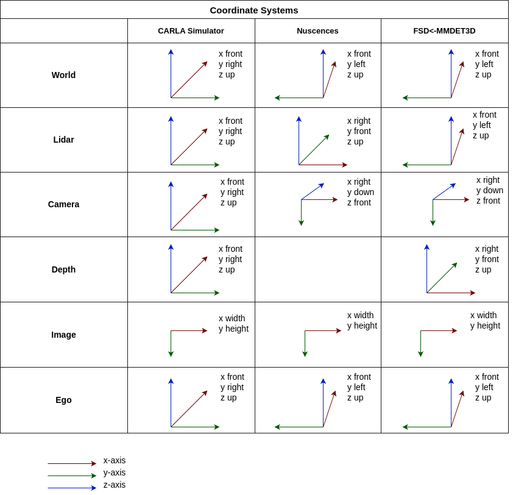
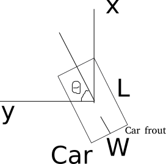

# Coordinate Systems 

## Overview
The coordinate systems in different datasets are different, which makes it difficult to unify the training and inference framework. 
This library reuses the unified coordinate systems in [MMDetection3D](https://mmdetection3d.readthedocs.io/en/latest/user_guides/coord_sys_tutorial.html). All coordinate systems in MMDetection3D follow right-handed conventions and can be catetorized into three:
- ***Depth coordinate***
  - x right
  - y front
  - z up (gravity axis)
- ***LiDAR coordinate***
  - x right
  - y front
  - z up (gravity axis)
- ***Camera coordinate***
  - x right
  - y down (gravity axis)
  - z front

The following figure summarizes different coordinates used in different dataset.

The KITTI [frame](https://www.cvlibs.net/datasets/kitti-360/documentation.php):
- World: x forward, y left, z up (gravity axis)
- Lidar: x forward, y left, z up (gravity axis)
- main Camera: x right, y down (gravity axis), z forward
- IMU/GPS: x forward, y right, z down -> IMU is ego

## Box Definition
The definition of coordinate systems is more than just defining the three axes. 
MMDetection3D defines a box as $x, y, z, dx, dy, dz, r$. 

- $x, y, z$ are coordinates of the center of the box in the corresponding coordinate system. See above figure.
- $dx, dy, dz$ are the dimensions of the box in the coordinate system. 
  - $dx$ is the length of the box, in the direction of the box heading.
  - $dy, dz$ have different meanings in different coordinate systems. 
    - In ***Depth coordinate***, $dy$ is the width of the box, and $dz$ is the height of the box as $z$ is the gravity axis.
    - In ***LiDAR coordinate***, $dy$ is the width of the box, and $dz$ is the height of the box as $z$ is the gravity axis.
    - In ***Camera coordinate***, $dy$ is the height of the box as $y$ is the gravity axis, and $dz$ is the width of the box. .

The three figures above are the 3D coordinate systems while the three figures below are the bird’s eye view.

**Yaw Angle Definition**

To define the yaw angle, we choose an axis as the gravity axis, and a reference direction on the plane perpendicular to the gravity axis. The reference direction has a yaw angle of 0. Because MMDetection3D is a right-handed coordinate system, the ascending directioj of the yaw angle is counter-clockwise if viewed from the top (the negative direction of the gravity axis with axis pointing at one's eyes).

## Box Definition in Other Datasets

### KITTI 

The Lidar coordinate system for a box in KITTI/SECOND is defined as follows (a bird's eye view). The KITTI LiDAR box format is $x, y, z, w, l, h, r$. 
- $x, y, z$ are coordinates of the center of the box in the LiDAR coordinate system.
- $w, l, h$ are the dimensions of the box in the LiDAR coordinate system. 
  - $w$ is the width of the box, and $l$ is the length of the box, and $h$ is the height of the box.
- $r$ is the yaw angle of the box in the LiDAR coordinate system. 
  - reference direction is the y-axis positive
  - yaw angle is defined as difference between the negative box direction and the reference direction
  - yaw angle increases clockwise 

 

The KITTI coordinate system is right-handed but only the yaw angle definition is left-handed.

To change a box in KITTI LiDAR coordinate system to the MMDetection3D LiDAR coordinate system, we need to change the order of the box dimensions and the yaw angle definition.
- $x_{mm}, y_{mm}, z_{mm} = x_{kitti}, y_{kitti}, z_{kitti}$
- $dx_{mm}, dy_{mm}, dz_{mm} = l, w, h$
- $r_{mm} = -r_{kitti} - \frac{pi}{2}$

### NuScenes
NuScenes box is a Box object as defined in NuScenes devkit. 
- `box.center` is the box center as $(x, y, z)$ in the global coordinate system in raw annoation
- `box.wlh` is in size of the box, width, length, height
- `box.orientation` is the orientation of the box in the global coordinate system in raw annotation

The reference direction for yaw definition is x-axis positive (see [script](../tools/analysis_tools/check_nuscenes_yaw_definition.py)), and yaw rotation is counter-clockwise around gravity axis. 

To change a NuScenes LiDAR box (need convert to LiDAR coordinate system first) to the MMDetection3D LiDAR box, we need to change the order of the box dimensions.
- $x_{mm}, y_{mm}, z_{mm} = y_{nuscenes}, -x_{nuscenes}, z_{nuscenes}$ due to the change of coordinate system
- $dx_{mm}, dy_{mm}, dz_{mm} = l, w, h$ due to chenge of box dimension definition
- $r_{mm} = r_{nuscenes} - \frac{pi}{2}$ due to change of yaw definition

Note the following transformations only change the NuScenes box to a MMDetection3D box convention, not the coordinate system. ***Note the difference between converting to a MMDetection3D box and converting to a MMDetection3D box convention***.
- $x_{mm}, y_{mm}, z_{mm} = x_{nuscenes}, y_{nuscenes}, z_{nuscenes}$ # points are still in NuScenes LiDAR coordinate system
- $dx_{mm}, dy_{mm}, dz_{mm} = l, w, h$ # due to chenge of box dimension definition
- $r_{mm} = r_{nuscenes}$ # yaw angle is still in NuScenes LiDAR coordinate system

## CARLA

