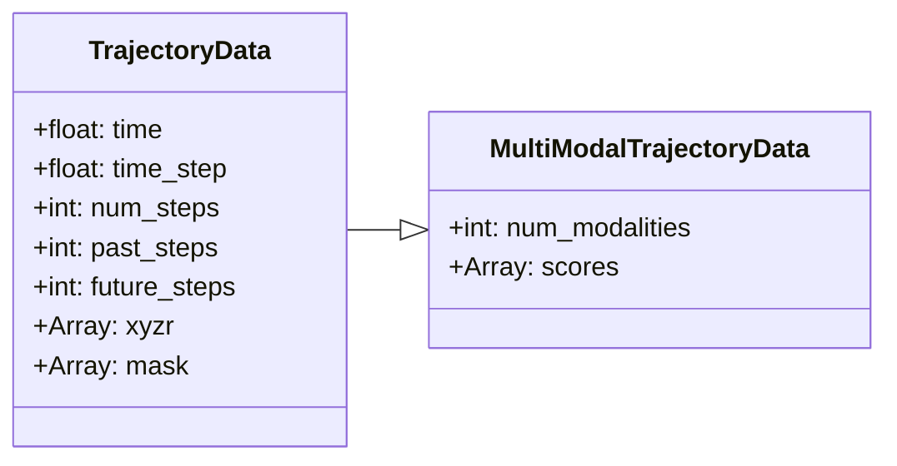
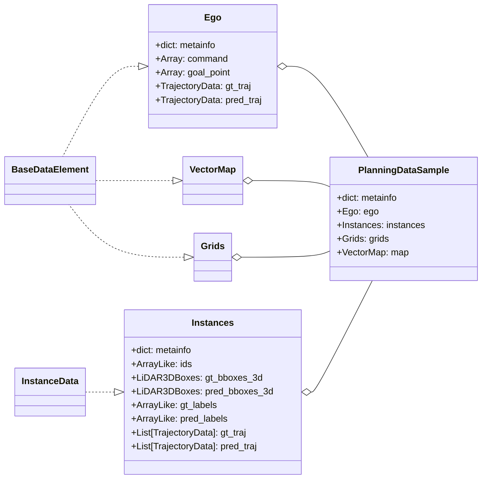

# Data Structure
The underlying data structure designed for automoumous motion planning and control tasks.

## TrajectoryData



## PlanningDataSample
All annotations are in lidar coord




```python
class PlanningDataSample(BaseDataElement):
    """
    Planning is usually performed with multi-modal sensors. The resulting annotation usually contains 3D bounding boxes from lidar annotation, which can then be transformed to various camera sensors if needed. 
    Here assume 3D annotation is available in Lidar coordinate (as in NuScene)

    The following attributes are reserved:
    
    metainfo:
        - timestamp
        - lidar_to_world
        - class_names


    DATA FIELD:
    gt_ego
        - goal_point
        - ego2world
        - future_trajectories
        - past_trajectories

    gt_instances_3d: InstanceData 
        - metainfo
            - xxx

        - bboxes: (LiDAR3DBoxes), 3d bounding boxes in lidar coordinate, with the option of including velocities
        - labels: (list or tensor), classification labels
        - ids: instance id used for tracking/instance seg
        - bboxes2world??? lidar2world?? -> TODO: do we need this??
        - past_trajectories: (Trajectories) in ego coordinate at current frame
        - future_trajectories: (Trajectories) in ego coordinate at current frame

    
    gt_pts_seg: PointData 


    MAP DATA
    gt_map
        - lane_labels
        - lane_bboxes
        - lane_mask

    """


```
