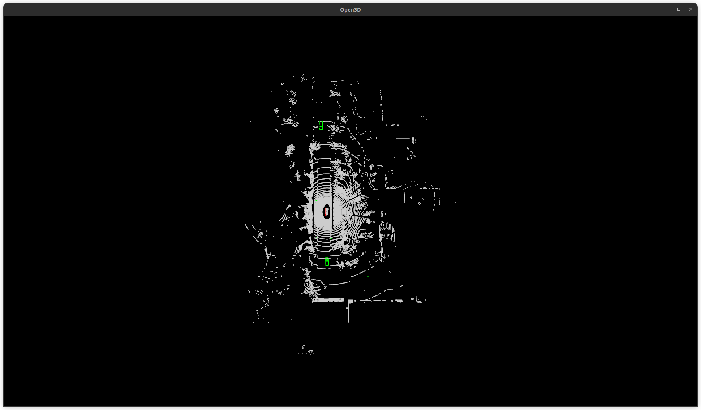
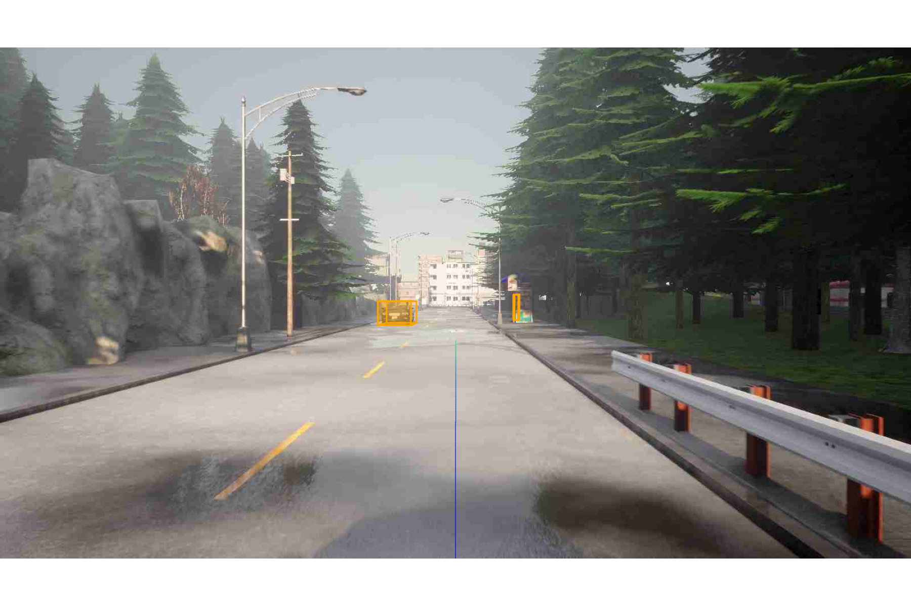

# Visualization

The following code loads a dataset config for visualization


```python

import cv2
import numpy as np
import torch 

from mmengine.config import Config
from mmengine.registry import init_default_scope

from mmdet3d.structures import LiDARInstance3DBoxes, DepthInstance3DBoxes, limit_period, Box3DMode
from fsd.runner import Runner
from fsd.registry import DATASETS, VISUALIZERS

# initialize the default scope
init_default_scope('fsd')
# load the configuration file
ds_cfg = Config.fromfile('fsd/configs/_base_/datasets/nuscenes.py')
# build the dataloader
ds = Runner.build_dataloader(ds_cfg.test_dataloader)

# visualizer configuration
vis_cfg = Config(dict(
    type='PlanningVisualizer',
    _scope_ = 'fsd',
    save_dir='./temp_dir',
    image_mode='rgb' if ds_cfg.to_rgb else 'bgr',
    vis_backends=[dict(type='LocalVisBackend')],
    name='vis')
)
vis = VISUALIZERS.build(vis_cfg) 


```

## Draw 3d boxes on point cloud

```Python
def draw_boxes_on_point_cloud(data_inputs, data_samples, vis):
    """
    Draw 3D bounding boxes on the point cloud.

    Args:
        data_inputs (dict): Input data containing images and point cloud data.
        data_samples (list): List of data samples containing ground truth information.
        vis (Visualizer): Visualizer object for rendering.
    """
    instances = data_samples[0].gt_instances_3d
    bboxes_3d = instances.bbox 
    pts = data_inputs['points'][0].numpy()
    
    # Create ego vehicle bounding box
    ego_size = data_samples[0].metainfo['ego_size']
    ego_box = torch.tensor([[0, 0, 0, ego_size[0], ego_size[1], ego_size[2], np.pi/2, 0, 0]])
    if ds.dataset.to_mmdet3d_lidar is None:
        ego_box = LiDARInstance3DBoxes(ego_box, box_dim=9)
    else:
        ego_box = DepthInstance3DBoxes(ego_box, box_dim=9)
    
    # Draw bounding boxes on the point cloud
    vis.set_points(pts, pcd_mode=0)  # 0: lidar, 1: cam, 2: depth
    bboxes_colors = [(0, 255, 0) for _ in range(len(bboxes_3d))] 
    vis.draw_bboxes_3d(bboxes_3d, bboxes_colors)
    vis.draw_bboxes_3d(ego_box, [(255, 0, 0)])

# run the visualizer
for i, item in enumerate(ds):
    data_inputs = item['inputs']
    data_samples = item['data_samples']
    
    ## draw point cloud
    draw_boxes_on_point_cloud(data_inputs, data_samples, vis)
    
    backend = 'matplotlib'#'matplotlib' # cv2
    if img is not None:
        if backend == 'matplotlib' and vis.image_mode == 'bgr':
            img = cv2.cvtColor(img, cv2.COLOR_BGR2RGB)
        elif backend == 'cv2' and vis.image_mode == 'rgb':
            img = cv2.cvtColor(img, cv2.COLOR_RGB2BGR)    
        
    vis.show(drawn_img=None, wait_time=0.1, backend=backend) # cv2 uses bgr

```




## Draw 3d boxes on camera images


## Draw ego future trajectory on camera images

```Python
def draw_trajectory_on_image(data_inputs, data_samples, vis):
    """
    Draw the ego vehicle's trajectory on the front camera image.

    Args:
        data_inputs (dict): Input data containing images and other metadata.
        data_samples (list): List of data samples containing ground truth information.
        vis (Visualizer): Visualizer object for rendering.
    """
    # Extract and preprocess images
    imgs = data_inputs['img'][0]
    imgs = [img.numpy().transpose(1, 2, 0) for img in imgs]
    
    # Get front camera image and transformation matrix
    cam_names = get_cam_names(data_samples[0].metainfo['img_path'])
    front_cam_idx = cam_names.index('CAM_FRONT')
    front_img = imgs[front_cam_idx]
    lidar2img = np.array(data_samples[0].metainfo['lidar2img'][front_cam_idx]) # 4x4
    
    # Extract ego trajectory
    ego_traj = data_samples[0].gt_ego.traj[:, [0, 1, 3]].cumsum(axis=0)
    ego_traj_xyr = ego_traj.numpy()
    ego_traj_mask = data_samples[0].gt_ego.traj_mask.numpy()
    
    # Draw trajectory on the image
    vis.set_image(front_img)
    vis.draw_trajectory_on_image(
        ego_traj_xyr,
        ego_traj_mask,
        input_meta={'lidar2img': lidar2img,
                    'future_steps': ego_traj.shape[0]},
        linewidths=4)

    return vis.get_image()

# run the visualizer
for i, item in enumerate(ds):
    data_inputs = item['inputs']
    data_samples = item['data_samples']
    
    ## draw images
    img = draw_trajectory_on_image(data_inputs, data_samples, vis)

    # backend and image mode switch
    backend = 'matplotlib'#'matplotlib' # cv2
    if img is not None:
        if backend == 'matplotlib' and vis.image_mode == 'bgr':
            img = cv2.cvtColor(img, cv2.COLOR_BGR2RGB)
        elif backend == 'cv2' and vis.image_mode == 'rgb':
            img = cv2.cvtColor(img, cv2.COLOR_RGB2BGR)    
        
    vis.show(drawn_img=img, wait_time=0.1, backend=backend) # cv2 uses bgr

```




## Draw Boxes on BEV 

```python
def draw_bev_bboxes(data_inputs, data_samples, vis, ds):
    """
    Draw 3D bounding boxes in the Bird's Eye View (BEV) perspective.

    Args:
        data_inputs (dict): Input data containing images and other metadata.
        data_samples (list): List of data samples containing ground truth information.
        vis (Visualizer): Visualizer object for rendering.
        ds (Dataset): Dataset object for accessing dataset-specific configurations.
    """
    # Extract 3D bounding boxes and ego vehicle size
    instances = data_samples[0].gt_instances_3d
    bboxes_3d = instances.bbox
    ego_size = data_samples[0].metainfo['ego_size']
    
    # Create ego vehicle bounding box
    ego_box = torch.tensor([[0, 0, 0, ego_size[0], ego_size[1], ego_size[2], np.pi/2, 0, 0]])
    if ds.dataset.to_mmdet3d_lidar is None:
        ego_box = LiDARInstance3DBoxes(ego_box, box_dim=9)
    else:
        ego_box = DepthInstance3DBoxes(ego_box, box_dim=9)
    
    # Draw bounding boxes on a blank BEV image
    bev = 255 * np.ones((900, 1200, 3), dtype=np.uint8)
    vis.set_image(bev, origin='lower')
    vis.draw_bboxes_on_bev(bbox_3d_ego=ego_box,
                           bboxes_3d_instances=bboxes_3d)

    return vis.get_image()
```

## Draw Multi-view 

```python
def draw_multiviews(data_inputs, data_samples, vis):
    """
    Draw multiview images with the ego trajectory overlaid on the front camera image.

    Args:
        data_inputs (dict): Input data containing images and other metadata.
        data_samples (list): List of data samples containing ground truth information.
        vis (Visualizer): Visualizer object for rendering.
    """
    # Extract and preprocess images
    imgs = data_inputs['img'][0]
    imgs = [img.numpy().transpose(1, 2, 0) for img in imgs]
    
    # Get front camera image and transformation matrix
    cam_names = get_cam_names(data_samples[0].metainfo['img_path'])
    front_cam_idx = cam_names.index('CAM_FRONT')
    front_img = imgs[front_cam_idx]
    lidar2img = np.array(data_samples[0].metainfo['lidar2img'][front_cam_idx]) # 4x4
    
    # Draw trajectory on the front camera image
    draw_trajectory_on_image(data_inputs, data_samples, vis)
    front_image = vis.get_image()
    imgs[front_cam_idx] = front_image
    
    # Reorder and draw multiview images
    view_order = ['CAM_FRONT_LEFT', 'CAM_FRONT', 'CAM_FRONT_RIGHT',
                  'CAM_BACK_LEFT', 'CAM_BACK', 'CAM_BACK_RIGHT']
    cam_idx = [cam_names.index(cam) for cam in view_order]
    imgs = [imgs[i] for i in cam_idx]
    multiview_imgs = vis.draw_multiviews(imgs, 
                                         view_order,
                                         target_size=(2100, 900), 
                                         arrangement=(2, 3),
                                         text_colors=(255, 255, 255))
    return multiview_imgs

```

## Draw Trajectory on BEV

```python

def draw_trajectory_on_bev(data_inputs, data_samples, vis, ds):
    """
    Draw the ego vehicle's trajectory on the Bird's Eye View (BEV) image.

    Args:
        data_inputs (dict): Input data containing images and other metadata.
        data_samples (list): List of data samples containing ground truth information.
        vis (Visualizer): Visualizer object for rendering.
        ds (Dataset): Dataset object for accessing dataset-specific configurations.
    """
    # Extract and preprocess images
    imgs = data_inputs['img'][0]
    imgs = [img.numpy().transpose(1, 2, 0) for img in imgs]
    
    # Create a blank BEV image and draw bounding boxes
    bev = 255 * np.ones((900, 1200, 3), dtype=np.uint8)
    vis.set_image(bev, origin='lower')
    bev = draw_bev_bboxes(data_inputs, data_samples, vis, ds)
    
    # Extract ego trajectory
    ego_traj = data_samples[0].gt_ego.traj[:, [0, 1, 3]].cumsum(axis=0)
    ego_traj_xyr = ego_traj.numpy()
    ego_traj_mask = data_samples[0].gt_ego.traj_mask.numpy()
    
    # Transform lidar coordinates to BEV if necessary
    lidar2bev = None
    if ds.dataset.to_mmdet3d_lidar is not None:
        lidar2bev = np.linalg.inv(ds.dataset.to_mmdet3d_lidar)
    
    # Draw trajectory on the BEV image
    vis.draw_trajectory_on_bev(
        ego_traj_xyr,
        ego_traj_mask,
        cmap='autumn',
        input_meta={'lidar2img': lidar2bev,
                    'future_steps': ego_traj.shape[0]},
        linewidths=2)    
    
    return vis.get_image()
```

## Draw Multi-modal Trajectory on BEV

```python

def draw_mutimodal_trajectory_on_bev(data_inputs, data_samples, vis, ds):
    """
    Draw multimodal ego trajectories on the Bird's Eye View (BEV) image.

    Args:
        data_inputs (dict): Input data containing images and other metadata.
        data_samples (list): List of data samples containing ground truth information.
        vis (Visualizer): Visualizer object for rendering.
        ds (Dataset): Dataset object for accessing dataset-specific configurations.
    """
    # Extract and preprocess images
    imgs = data_inputs['img'][0]
    imgs = [img.numpy().transpose(1, 2, 0) for img in imgs]
    
    # Create a blank BEV image and draw bounding boxes
    bev = 255 * np.ones((900, 1200, 3), dtype=np.uint8)
    vis.set_image(bev, origin='lower')
    bev = draw_bev_bboxes(data_inputs, data_samples, vis, ds)
    
    # Extract ego trajectory and create multimodal variations
    ego_traj = data_samples[0].gt_ego.traj[:, [0, 1, 3]].cumsum(axis=0)
    ego_traj_xyr = ego_traj.numpy()
    ego_traj_mask = data_samples[0].gt_ego.traj_mask.numpy()
    M = 3  # Number of multimodal trajectories
    ego_multimodal_traj = [ego_traj + np.random.rand(*ego_traj_xyr.shape) for _ in range(M)] 
    ego_multimodal_traj = np.stack(ego_multimodal_traj, axis=0)
    
    # Transform lidar coordinates to BEV if necessary
    lidar2bev = None
    if ds.dataset.to_mmdet3d_lidar is not None:
        lidar2bev = np.linalg.inv(ds.dataset.to_mmdet3d_lidar)
    
    # Draw multimodal trajectories on the BEV image
    vis.draw_trajectory_on_bev(
        ego_multimodal_traj,
        ego_traj_mask,
        cmap='autumn',
        input_meta={'lidar2img': lidar2bev,
                    'future_steps': ego_multimodal_traj.shape[-2]},
        linewidths=2)    
    
    return vis.get_image()

```

## Draw Multi-modal Trajectory on Camera Images

```python

def draw_mutimodal_trajectory_on_image(data_inputs, data_samples, vis):
    """
    Draw multimodal ego trajectories on the front camera image.

    Args:
        data_inputs (dict): Input data containing images and other metadata.
        data_samples (list): List of data samples containing ground truth information.
        vis (Visualizer): Visualizer object for rendering.
    """
    # Extract and preprocess images
    imgs = data_inputs['img'][0]
    imgs = [img.numpy().transpose(1, 2, 0) for img in imgs]
    
    # Get front camera image and transformation matrix
    cam_names = get_cam_names(data_samples[0].metainfo['img_path'])
    front_cam_idx = cam_names.index('CAM_FRONT')
    front_img = imgs[front_cam_idx]
    lidar2img = np.array(data_samples[0].metainfo['lidar2img'][front_cam_idx]) # 4x4
    
    # Extract ego trajectory and create multimodal variations
    ego_traj = data_samples[0].gt_ego.traj[:, [0, 1, 3]].cumsum(axis=0)
    ego_traj_xyr = ego_traj.numpy()
    ego_traj_mask = data_samples[0].gt_ego.traj_mask.numpy()
    M = 3  # Number of multimodal trajectories
    ego_multimodal_traj = [ego_traj_xyr + np.random.rand(*ego_traj_xyr.shape) for _ in range(M)]
    ego_multimodal_traj = np.stack(ego_multimodal_traj, axis=0)
    
    # Draw multimodal trajectories on the image
    vis.set_image(front_img)
    vis.draw_trajectory_on_image(
        ego_multimodal_traj,
        ego_traj_mask,
        input_meta={'lidar2img': lidar2img,
                    'future_steps': ego_multimodal_traj.shape[-2]},
        linewidths=4)

    return vis.get_image()

```
